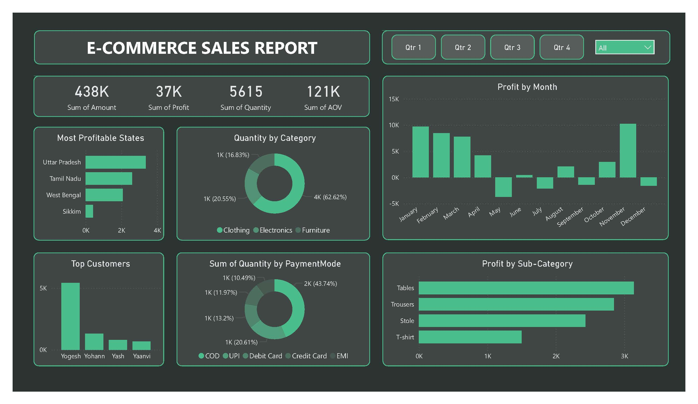

# 📊 E-Commerce Sales Report (Power BI)

---

## 📌 Overview
This project is an **interactive Sales Dashboard** built using Power BI.  
It analyzes a fictional retail company's sales data to provide insights on **regional performance, product profitability, and revenue trends**.  
The dashboard is designed to help business stakeholders make **data-driven decisions** quickly.

---

## 🛠 Tools Used
- **Power BI Desktop** – Data modeling, visualization, DAX calculations
- **Excel** – Data preprocessing
- **Power Query** - Data Preprocessing
- **DAX** – Custom measures & KPIs
- **Data Source** – Sample Superstore dataset

---

## 📂 Dataset
**Source**: [Sample Superstore Sales](Datasets)  
**Format**: `.csv`
**Size**: ~2,000 rows in 2 files
**License**: Open dataset for educational purposes

---

## 📊 Key Insights
- **Top-Performing States**: Uttar Pradesh, Tamil Nadu, and West Bengal are the 3 most performing states.
- **Most Profitable Category**: Tables generate the highest profit margin, followed by Trousers and Stoles.
- **Seasonal Trend**: Sales are particularly high throughout Q1.
- **Payment Mode**: 43.74% of purchases were made using the Cash on Delivery (COD) payment method.

---

## 📸 Power BI Report (Dashboard) Preview

---

## 📜 License
This project is licensed under the **MIT License** – see the [LICENSE](LICENSE) file for details.

